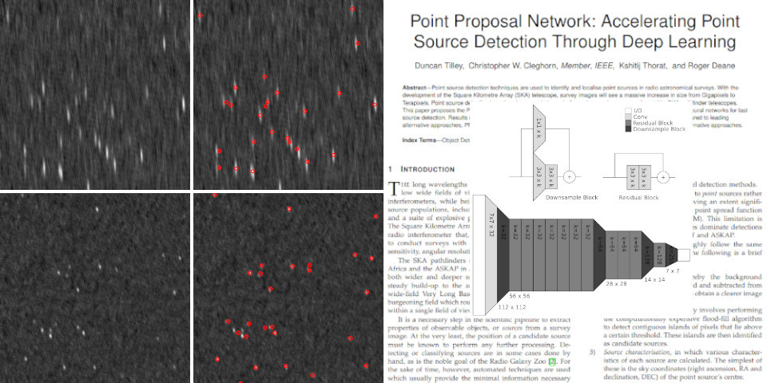

# Point Proposal Network

Point source detection techniques are used to identify and localise point sources in radio astronomical surveys. With the development of the Square Kilometre Array (SKA) telescope, survey images will see a massive increase in size from Gigapixels to Terapixels. Point source detection has already proven to be a challenge in recent surveys performed by SKA pathfinder telescopes. This paper proposes the Point Proposal Network (PPN): a point source detector that utilises deep convolutional neural networks for fast source detection. Results measured on simulated MeerKAT images show that, although less precise when compared to leading alternative approaches, PPN performs source detection faster and is able to scale to large images, unlike the alternative approaches.



## Paper

- [IEEE Xplore](https://ieeexplore.ieee.org/document/9660085)
- [arXiv Preprint](https://arxiv.org/abs/2008.02093)
- [Preprint PDF](https://arxiv.org/pdf/2008.02093)

## Citation

```bibtex
@inproceedings{Tilley2021,
  author={Tilley, Duncan and Cleghorn, Christopher W. and Thorat, Kshitij and Deane, Roger},
  booktitle={2021 IEEE Symposium Series on Computational Intelligence (SSCI)},
  title={Point Proposal Network: Accelerating Point Source Detection Through Deep Learning},
  year={2021},
  pages={1-8},
  doi={10.1109/SSCI50451.2021.9660085}
}
```

## Requirements

- Python 3.7
- Tensorflow 1.14
- OpenCV 2 (optional, tested on 3.2)
